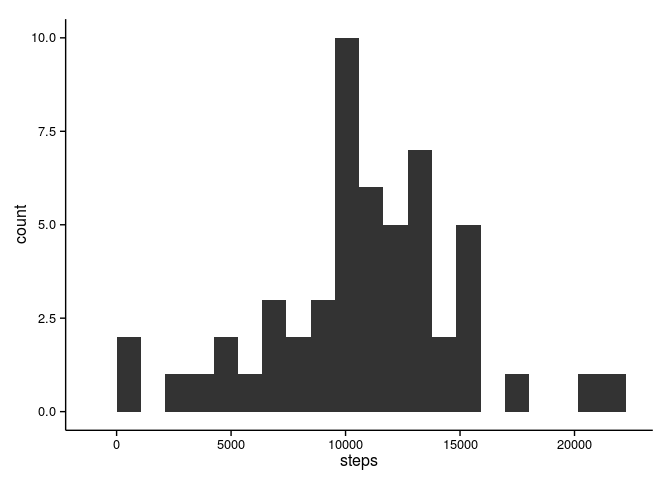

# Reproducible Research: Peer Assessment 1


## Loading and preprocessing the data

The dataset is stored in a comma-separated-value (CSV) file and there are a total of 17,568 observations in this dataset.


```
## Loading required package: data.table
## Loading required package: ggplot2
## Loading required package: scales
```

1. Load the data

```r
zipfile <- "activity.zip"
csvfile <- "activity.csv"

if (!file.exists(csvfile)) {
    unzip(zipfile)
}

dt <- fread(csvfile, na.strings = "NA")
```

2. Process/transform the data into a format suitable for analysis

```r
dt[, date:=as.IDate(date, "%Y-%m-%d")]
dt[, interval:=as.ITime(sprintf("%04d",interval), "%H%M")]
setkey(dt, date)
```

## What is mean total number of steps taken per day?

1. Calculate the total number of steps taken per day

```r
dt2 <- dt[,sum(steps, na.rm=TRUE),by=date]
setnames(dt2, "V1", "steps")
```

2. Make a histogram of the total number of steps taken each day

```r
ggplot(dt2, aes(x=steps)) + geom_histogram(binwidth=max(dt2$steps)/20) + theme_classic()
```

 

3. Calculate and report the mean and median of the total number of steps taken per day

```r
mean(dt2$steps, na.rm=TRUE)
```

```
## [1] 9354.23
```

```r
median(dt2$steps, na.rm=TRUE)
```

```
## [1] 10395
```

## What is the average daily activity pattern?

1. Make a time series plot of the 5-minute interval (x-axis) and the average number of steps taken, averaged across all days (y-axis)

```r
dt3 <- dt[,mean(steps, na.rm=TRUE),by=interval]
dt3[,time:=as.POSIXct(interval, origin="1970-01-01")]
setnames(dt3, "V1", "average")
ggplot(dt3, aes(x=time, y=average)) + geom_line() + theme_classic() +
    scale_x_datetime(expand=c(0,0), labels=date_format("%H:%M"), breaks=date_breaks("2 hour"))
```

 

2. Which 5-minute interval, on average across all the days in the dataset, contains the maximum number of steps?

```r
format(dt3$time[dt3$average == max(dt3$average)], format="%H:%M")
```

```
## [1] "08:35"
```

## Imputing missing values

The presence of missing days may introduce bias into some calculations or summaries of the data.

1. Calculate and report the total number of missing values in the dataset

```r
sum(is.na(dt$steps))
```

```
## [1] 2304
```

2. I'll be using the median of 5-minute interval across all the days as a strategy for filling in all of the missing values in the dataset. 

```r
dt4 <- copy(dt)
dt4[,median:=median(steps, na.rm=TRUE),by=interval]
# Different approach
#joined <- dt[dt4[,.(interval,median)]]
```

3. Create a new dataset that is equal to the original dataset but with the missing data filled in.

```r
dt4[is.na(steps),steps:=median]
```

4. Make a histogram of the total number of steps taken each day and Calculate and report the mean and median total number of steps taken per day.

```r
dt5 <- dt4[,sum(steps),by=date]
setnames(dt5, "V1", "steps")
ggplot(dt5, aes(x=steps)) + geom_histogram(binwidth=max(dt5$steps)/20) + theme_classic()
```

 

The total number of steps taken each and the mean total number of steps taken per day are different from the first part of the assignment. However the strategy for filling in all of the missing values chosen for this assignment caused no change in median.

```r
mean(dt5$steps)
```

```
## [1] 9503.869
```

```r
median(dt5$steps)
```

```
## [1] 10395
```

## Are there differences in activity patterns between weekdays and weekends?

1. Create a new factor variable in the dataset with two levels – “weekday” and “weekend” indicating whether a given date is a weekday or weekend day.

```r
dt6 <- copy(dt)
dt6[,day:=as.integer(format(dt6$date, format="%u"))]
dt6[,day:=factor(dt6$day > 5, levels=c(TRUE, FALSE), labels=c("weekend", "weekday"))]
```

2. Make a panel plot containing a time series plot of the 5-minute interval (x-axis) and the average number of steps taken, averaged across all weekday days or weekend days (y-axis).

```r
dt7 <- dt6[,mean(steps, na.rm=TRUE),by=.(interval, day)]
dt7[,time:=as.POSIXct(interval, origin="1970-01-01")]
setnames(dt7, "V1", "average")
ggplot(dt7, aes(x=time, y=average)) + geom_line() + theme_classic() + facet_grid(day ~ .) +
    scale_x_datetime(expand=c(0,0), labels=date_format("%H:%M"), breaks=date_breaks("2 hour")) +
    labs(x="Hour of day", y="Average number of steps")
```

 
